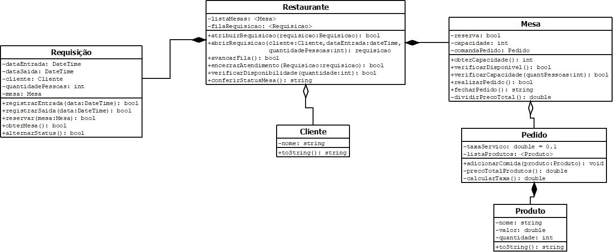

# Diagramas de classe
Coloque aqui todas as versões do seu diagrama de classes. Cada versão deve começar com um número de dois dígitos, na ordem crescente.

TP1:

TP2:

TP3:

TP3:

TP3 - Diagrama Final:

